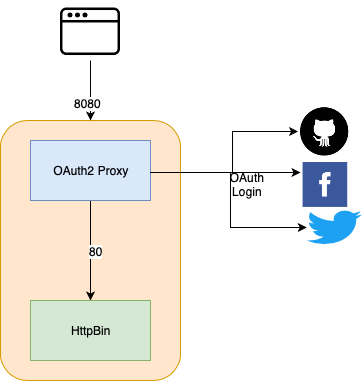
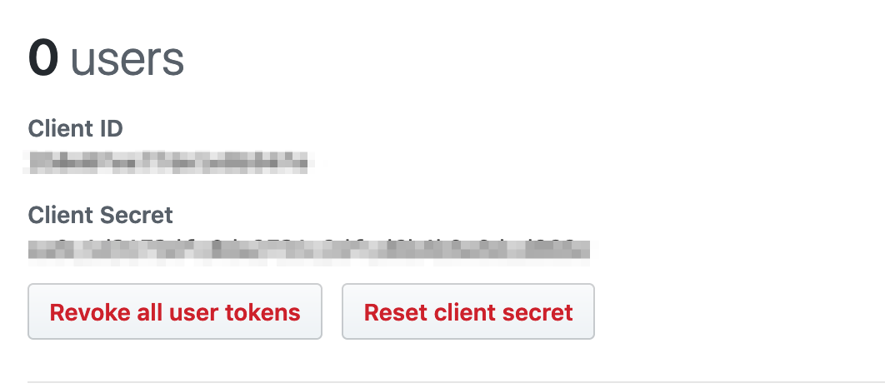
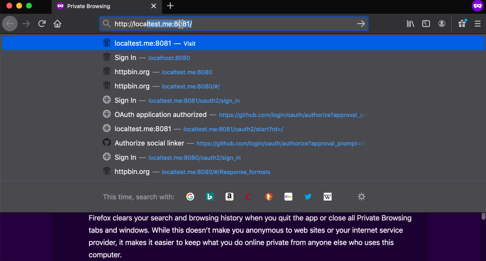

# Protecting applications with OAuth2 Proxy

Here is a simple guide on protecting a website with social logins supporting OAuth2. 
It uses an open source ([OAuth2 Proxy](https://github.com/oauth2-proxy/oauth2-proxy)
to secure private applications without adding any authenticating login in the application itself.

Here is what the architecture looks like.



In this guide, we will setup a Github OAuth application but it can be easily used with any other provider. See [Providers](https://pusher.github.io/oauth2_proxy/auth-configuration) for different config options.

#### Setting up Github Application:

Login to your github account and navigate to [Developer Settings](https://github.com/settings/developers). Click on OAuth Apps and Register a new application.

I'll call this application SocialBin and set the homepage as http://localtest.me. Localtest.me is a DNS configured to point to 127.0.0.1 and makes it easy to do local testing. Read more [here](https://readme.localtest.me).

We will be running the application on port 8080 so the callback url is set as http://localtest.me:8080/oauth2/callback.

That is it for setting up the application. Note down the Client ID and Client Secret which will be used later.



#### Running application with proxy:

Clone this [Github project](https://github.com/namuan/oauth2-proxy-httpbin) and then copy or move the example configuration file. 
```
cp .env.example .env
```

You can also run the following command to generate a random value which we'll use for cookie secret.
```
head -c32 /dev/urandom | base64
```

Edit the .env file and update the variables. 
```
OAUTH2_PROXY_COOKIE_SECRET=<generated random value>
OAUTH2_PROXY_COOKIE_DOMAIN=http://localtest.me
OAUTH2_PROXY_CLIENT_ID=<github client id>
OAUTH2_PROXY_CLIENT_SECRET=<github client secret>
```

Now, switch over to docker-compose.yml which is setting up two docker containers. The [httpbin](https://hub.docker.com/r/kennethreitz/httpbin) container is the service we are trying to protect so you can see that it is not exposing any ports. The `"--upstream=http://httpbin:80",` configuration is telling the oauth2 proxy where to send the traffic once the login is successful.

With everything in its place, we can bring up the containers using `docker-compose`.
```
docker-compose up
```

It'll take some time if it is running for the first time to pull any missing docker images. Once everything is running, you can visit `http://localtest.me:8080/` in the browser which should show you a screen with a button to "Sign in with Github". Here is a brief sequence of the login flow and accessing httpbin.



